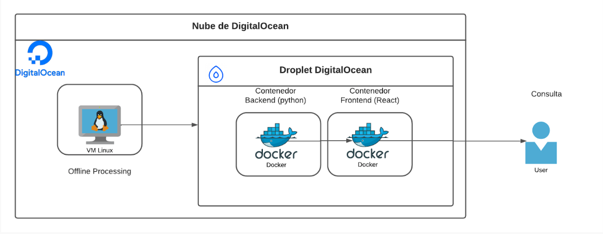

# Terretorno - Extract features sentences using NLP

## 📝 Description
Land restitution unit needs to organize sentences (some with more than 100 pages) format, organize sentences according to 5 variables. 
Sense of the decision, Victim (who dispossesses the land), Name who makes the claim. 

## 👩‍💻 Stack Tecnologies

- Backend -> FastApi, Python.
- Frontend -> React, NodeJS.
- Models -> Supervised model Using xgboost.

## 🎢 project structure

        ├── README.md                <- Understanding of the project
        │      
        ├── Backend                 <- Backend code
        │      
        ├── Frontend                <-  Frontend Code
        │
        ├── NLPtest                <-  folder where the trainings are located
        │
        ├── Develop                <-  Colder where the algorithms for the model and its stages were developed

## 🏗️ Architecture

## Additional Resources
- [Backend Guide](./docs/back_guide.md)
- [Frontend Guide](./docs/front_guide.md)
- [Data Science Guide](./docs/data_guide.md)